 

  

 

## 👋 About Me

I'm a **B.Tech CSE student and Full Stack Developer** who enjoys building things end-to-end — from designing interfaces and developing APIs to working with databases and integrating AI-powered features.

My primary stack revolves around **React, Next.js, Node.js, Java, and Spring Boot**. I'm also exploring **AI/LLM applications, Three.js, WebGL, animation, and system design** to create more intelligent and interactive experiences.

I enjoy solving problems, participating in hackathons, experimenting with new technologies, and continuously improving the way I build software.

const harsh = {
  role: "B.Tech CSE Student",

  focus: [
    "Full Stack Development",
    "AI / LLM Applications",
    "Interactive Web",
    "System Design"
  ],

  frontend: [
    "React",
    "Next.js",
    "JavaScript",
    "Tailwind CSS",
    "Three.js"
  ],

  backend: [
    "Node.js",
    "Express.js",
    "Java",
    "Spring Boot"
  ],

  databases: [
    "PostgreSQL",
    "MySQL",
    "MongoDB",
    "Supabase"
  ],

  tools: [
    "Git",
    "GitHub",
    "VS Code",
    "Postman",
    "Figma"
  ],

  mindset: "Build. Learn. Improve. Ship."
};

 

## ⚡ What I Do

<table align="center">
<tr>

<td width="33%" valign="top" align="center">

### 🌐 Full Stack Development

Building complete web applications with modern frontend frameworks, backend APIs, authentication, databases, and scalable architecture.

</td>

<td width="33%" valign="top" align="center">

### 🤖 AI & LLM

Exploring practical applications of AI, LLM-powered features, intelligent workflows, and AI integrations inside modern applications.

</td>

<td width="33%" valign="top" align="center">

### 🎨 Interactive Web

Experimenting with **Three.js, WebGL, animations, and immersive interfaces** to create experiences beyond traditional websites.

</td>

</tr>
</table>

 

## 🛠️ Tech Stack

<table align="center">

<tr>

<td width="50%" valign="top">

### 💻 Languages

  

### 🎨 Frontend

</td>

<td width="50%" valign="top">

### ⚙️ Backend & Database

  

### 🔧 Tools

</td>

</tr>

</table>

 

## 📈 Development Journey

<table>
<tr>

<td align="center">

💻

 

<b>Full Stack</b>

 

Frontend + Backend + Database

</td>

<td align="center">

⚡

 

<b>Production</b>

 

Building real-world applications

</td>

<td align="center">

🧠

 

<b>Problem Solving</b>

 

DSA + Development

</td>

<td align="center">

🏆

 

<b>Hackathons</b>

 

Building under pressure

</td>

</tr>
</table>

 

## 📊 GitHub Stats

  

 

🏆 GitHub Trophies

 

 

## 🐍 Contribution Snake

<picture>

<source
 media="(prefers-color-scheme: dark)"
 srcset="https://raw.githubusercontent.com/hs150/hs150/output/github-contribution-grid-snake-dark.svg"
/>

<source
 media="(prefers-color-scheme: light)"
 srcset="https://raw.githubusercontent.com/hs150/hs150/output/github-contribution-grid-snake.svg"
/>

</picture>

 

## 🌱 Currently Learning

`Advanced Next.js`
 • 
`Three.js`
 • 
`System Design`
 • 
`AI / LLM Applications`
 • 
`Backend Architecture`

 

## 🎯 Interests

`Full Stack Development`
  •  
`AI Engineering`
  •  
`Developer Tools`
  •  
`Interactive Web`
  •  
`System Design`
  •  
`Open Source`

 

## 🤝 Let's Connect

 

### ⚡ Build. Learn. Ship. Repeat.

 

